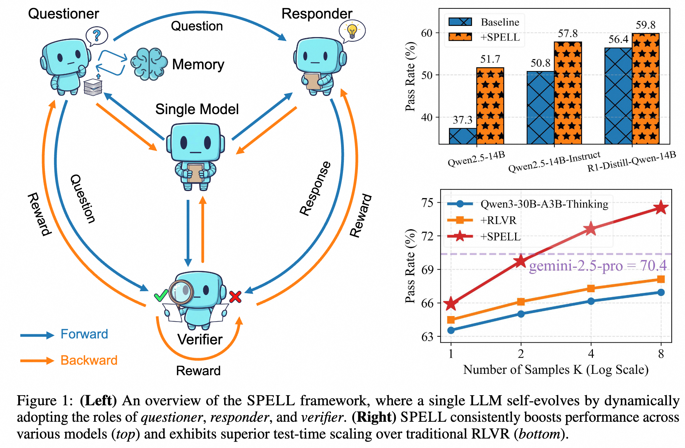
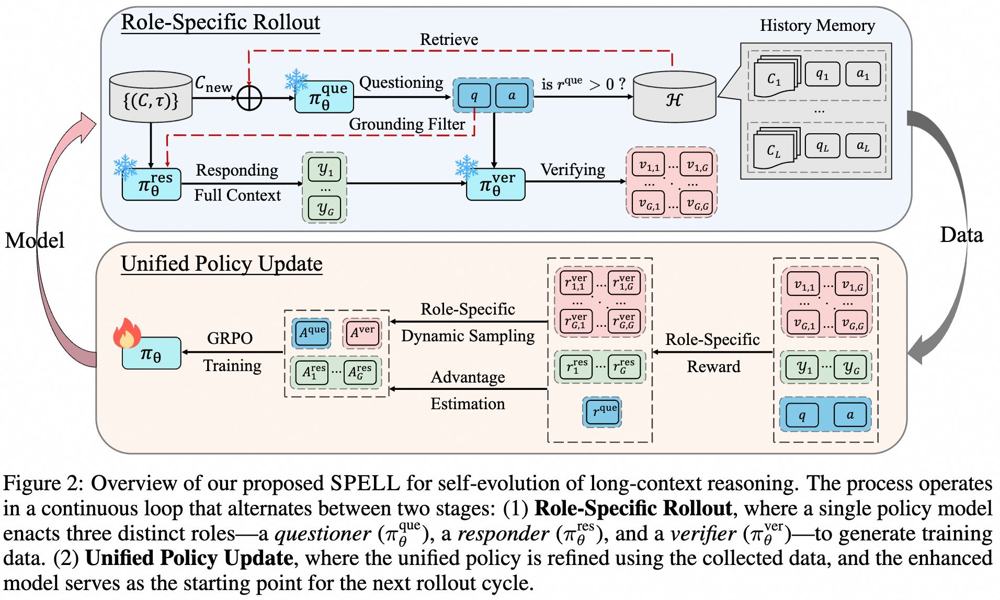
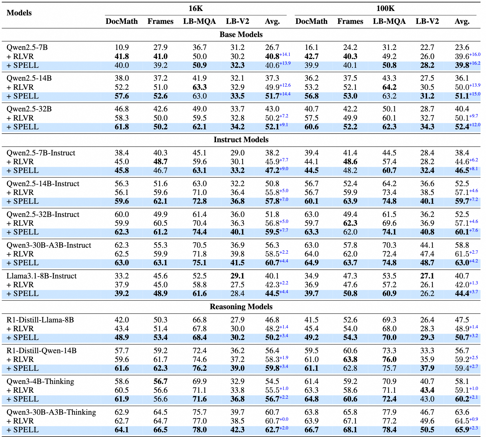
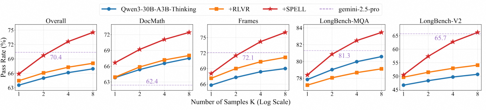

<p align="center" width="100%">
</p>

<div id="top" align="center">

SPELL: Self-Play Reinforcement Learning for Evolving Long-Context Language Models
-----------------------------
 


<h4> |<a href="https://arxiv.org/pdf/2509.23863"> 📑 SPELL Paper</a> |
<a href="https://huggingface.co/Tongyi-Zhiwen"> 🤗 HuggingFace Repo </a> |
<a href="https://github.com/Tongyi-Zhiwen/SPELL"> 🐱 GitHub Repo </a> |
</h4>


</div>

This repository provides the implementation of **SPELL: Self-Play Reinforcement Learning for Evolving Long-Context Language Models**. SPELL is a novel methodology that leverages self-play reinforcement learning to enhance the capabilities of large language models, specifically targeting improvements in long-context understanding and reasoning tasks. The code implementation will be released soon!

# 📖 Overview

Progress in long-context reasoning for large language models (LLMs) has been hampered by the scarcity of reliable human annotations and the absence of programmatically verifiable reward signals. To address this, we propose **SPELL**, a multi-role self-play reinforcement learning framework that enables scalable, label-free optimization for long-context reasoning.

In the SPELL framework, a single LLM continually improves itself by cyclically adopting three distinct roles:
- The **Questioner**: Generates complex questions and reference answers from raw, unlabeled documents.
- The **Responder**: Learns to solve these questions by reasoning over the provided documents.
- The **Verifier**: Evaluates the semantic equivalence between the responder's output and the reference answer, generating robust reward signals to guide training.

This self-sufficient, closed-loop system allows the model to autonomously generate its own curriculum, progressively increasing question difficulty and context length, thereby pushing the boundaries of its reasoning abilities without any need for human-labeled data.

<p align="center">
     <br>
</p>


# 🧠 Methodology

The core of SPELL is a self-play evolutionary loop where a single policy model ($\pi_\theta$) dynamically assumes the three roles to generate data and learn from it.

<p align="center">
     <br>
</p>

The process iterates through two main stages:

**1. Role-Specific Rollout:**
- **Questioning**: The *questioner* is conditioned on a subset of documents and a *history memory* of recently solved questions. This memory encourages the generation of novel and progressively more difficult questions that require integrating information across an expanding context.
- **Responding**: The *responder* attempts to answer the generated question using the complete set of documents, which includes distractor documents unseen by the questioner. This forces the model to ground its reasoning in the provided text rather than relying on parametric knowledge.
- **Verifying**: The *verifier* assesses the semantic correctness of the responder's answer against the reference answer generated by the questioner. It uses an ensemble method (majority voting over multiple judgments) to produce a stable and reliable reward signal, overcoming the brittleness of simple string matching.

**2. Unified Policy Update:**
- **Role-Specific Rewards**: Each role is guided by a specialized reward function. The questioner is incentivized to create questions at the frontier of the responder's capabilities (i.e., not too easy, not too hard). The responder is rewarded for correctness, and the verifier is trained for self-consistency to improve its judgment reliability.
- **Joint Optimization**: The data collected from all three roles is used to perform a unified policy update using Group Relative Policy Optimization (GRPO). The updated policy is then used for all roles in the next iteration, closing the self-improvement loop.

# 📊 Experiments

We evaluated SPELL across 12 diverse open-source LLMs (ranging from 4B to 32B parameters) on six challenging long-context question-answering benchmarks.

**Key Findings:**
- **Consistent Performance Gains**: SPELL delivered substantial and consistent performance improvements across all tested models, including dense and Mixture-of-Experts (MoE) architectures. For example, it achieved an average 7.6-point gain on the strong Qwen3-30B-A3B-Thinking model.
- **Superiority over Static RL**: SPELL significantly outperforms traditional Reinforcement Learning with Verifiable Rewards (RLVR) baselines that are trained on a static, high-quality dataset. Its dynamic curriculum adapts to the model's evolving capabilities, proving more effective for sustained improvement.
- **Data Efficiency**: Base models trained with SPELL were able to surpass their instruction-tuned counterparts, which rely on extensive human-annotated data. This highlights the efficiency of our label-free self-play approach.
- **Enhanced Exploration**: SPELL boosts a model's test-time exploration capabilities. Models trained with SPELL show a much steeper improvement curve on the pass@k metric, ultimately raising their performance ceiling and even surpassing leading models like `gemini-2.5-pro` at pass@4.

<p align="center">
     <br>
</p>


<p align="center">
     <br>
</p>


# Reproducing the Results

## 🛠️ Requirements

To set up the project environment, please follow the steps below. These commands will create a dedicated Conda environment and install all necessary dependencies.

```bash
# Create the conda environment
conda create -n spell python==3.10.16
conda activate spell

# Install verl
cd verl
pip install -e .

# Install vLLM
pip install vllm==0.8.5.post1

# Install flash-attn
pip install flash-attn --no-build-isolation

cd ..
pip install -r requirements.txt
```

## 🚀 Quick Start

This section provides a comprehensive guide to using the SPELL model, from dataset preparation to training and evaluation.

### 🗂️ Dataset

The training process utilizes the following datasets, and we provide processed daatsets in the `dataset/` directory:

*   **`dataset/docmath_qa/train.parquet`**: A training dataset for mathematical reasoning over financial documents.
*   **`dataset/ultra_fineweb/train.parquet`**: A large-scale, high-quality web dataset used for pre-training language models.

For more details, please refer to the our Appendix in our paper.

For evaluation, you will need to download the following benchmarks from HuggingFace and ensure the paths are correctly configured in `eval/generate.py`:

*   **`yale-nlp/DocMath-Eval`**
*   **`THUDM/LongBench`**
*   **`THUDM/LongBench-v2`**
*   **`Tongyi-Zhiwen/frames`**

### 💻 Training

To begin training, start a multi-node Ray cluster using the provided script:

```bash
scripts/start_ray.sh
```

The training scripts in the `scripts/` directory are optimized for a distributed setup consisting of nodes equipped with 8 x 80G NVIDIA A100 GPUs.

After training, you need to transform the model from fsdp to hf model.

```bash
verl/scripts/model_merge.sh
```

#### Implementation Details

Our codebase is built upon **VeRL**. The key modifications and additions for SPELL are located in the following files:

**Trainer:**

*   `verl/verl/trainer/main_ray_spell.py` (new)
*   `verl/verl/trainer/ppo/ray_spell_trainer.py` (new, core SPELL training loop)
*   `verl/verl/trainer/config/spell_trainer.yaml` (new, configuration file)
*   `verl/verl/trainer/ppo/core_algos.py` (lines 199-373, role-specific reward & advantage estimation)
*   `verl/verl/trainer/ppo/metric_utils.py` (lines 80-447, role-specific metrics)

**Dataset:**

*   `verl/verl/utils/dataset/spell_dataset.py` (new, data collector & history memory)
*   `verl/verl/utils/dataset/prompts.py` (new, prompt templates)

**Workers:**

*   `verl/verl/workers/rollout/vllm_rollout/vllm_rollout_spmd.py` (line 257, 275-279, specify rollout number)
*   `verl/verl/workers/actor/dp_actor.py` (lines 370-371, ensure once update for each training batch)

### 📊 Evaluation

We conduct a thorough evaluation on six long-context Document Question Answering (DocQA) benchmarks. These include multiple-choice (LongBench-v2), multi-hop reasoning (2WikiMultihopQA, HotpotQA, MuSiQue, Frames), and financial report reasoning (DocMath) tasks. The final score is reported as the maximum of the cover exact match and an LLM-judged accuracy score provided by `gpt-oss-120b`.

The evaluation process is detailed in `eval/scripts/eval_single.sh` and consists of two main steps.

#### Step 0: Prepare Datasets

Before beginning, ensure you have downloaded the necessary evaluation datasets from HuggingFace and have correctly updated the file paths within the `eval/generate.py` script.

#### Step 1: Generate Model Outputs

This step generates the model's responses for the evaluation benchmarks. The script is configured to test the model on two different input length settings (16K and 100K tokens).

```bash
#!bin/bash
export CUDA_VISIBLE_DEVICES=0,1,2,3
export VLLM_WORKER_MULTIPROC_METHOD='spawn'

PROJ_DIR="eval"

TP=0.7
TOP_P=0.95
TOP_K=-1

TASKS_LIST=("docmath" "frames" "2wikimqa" "hotpotqa" "musique" "longbench-v2") 

N_SAMPLES=8

MAX_OUTPUT_LEN=20000

MODEL_NAME=Qwen3-30B-A3B-Thinking-2507
MODEL_PATH="<your_model_path>/${MODEL_NAME}"

mkdir -p ${PROJ_DIR}/results

# test in two different input length settings
for MAX_INPUT_LEN in 16384 100000
do

    SAVE_NAME="${MODEL_NAME}_I${MAX_INPUT_LEN}_O${MAX_OUTPUT_LEN}_N${N_SAMPLES}"

    # Step1: generate model outputs
    python ${PROJ_DIR}/generate.py \
        --input_dir "${PROJ_DIR}/data" \
        --save_dir "${PROJ_DIR}/results" \
        --save_file ${SAVE_NAME} \
        --model "${MODEL_PATH}" \
        --tokenizer "${MODEL_PATH}" \
        --tasks "${TASKS_LIST[@]}" \
        --n_sampling ${N_SAMPLES} \
        --temperature ${TP} \
        --top_p ${TOP_P} \
        --max_input_len ${MAX_INPUT_LEN} \
        --max_output_len ${MAX_OUTPUT_LEN} \
        --gpu_memory_utilization 0.9 \
        --top_k ${TOP_K} \
        --split ${N_SAMPLES} 

done

```

#### Step 2: Generate Evaluation Results

To obtain the LLM-judged accuracy, you first need to serve the `gpt-oss-120b` model as an OpenAI API endpoint.

**Serve the Judge Model (`gpt-oss-120b`)**

Use the following command to serve the judge model on your local machine using vLLM.

```bash
VLLM_USE_TRITON_FLASH_ATTN=1 # Flag to control if you wantAI Inference Server to use Triton Flash Attention.
VLLM_FLASH_ATTN_VERSION=3 # Force AI Inference Server to use a specific flash-attention version (2 or 3), only valid with the flash-attention backend.

vllm serve openai/gpt-oss-120b \
    --served-model-name gpt-oss-120b \
    --host 0.0.0.0 \
    --async-scheduling \
    --tensor-parallel-size 2 \
    --max-model-len 16384 \
    --port 23547

```

**Run the Evaluation Script**

Once the judge model is running, execute the script below to verify the generated outputs and calculate the final scores. Remember to replace `<your_api_host>` and `<your_api_port>` with the actual host and port of your judge model endpoint.

```bash
#!bin/bash
PROJ_DIR="eval"

TP=0.7
TOP_P=0.95
TOP_K=-1

TASKS_LIST=("docmath" "frames" "2wikimqa" "hotpotqa" "musique" "longbench-v2") 

JUDGE_MDOEL="gpt-oss-120b"
VERIFIER_HOST="<your_api_host>"
VERIFIER_PORT="<your_api_port>"
API_BASE="http://${VERIFIER_HOST}:${VERIFIER_PORT}/v1"

N_SAMPLES=8

MAX_OUTPUT_LEN=20000

MODEL_NAME=Qwen3-30B-A3B-Thinking-2507
MODEL_PATH="<your_model_path>/${MODEL_NAME}"

mkdir -p ${PROJ_DIR}/results

# test in two different input length settings
for MAX_INPUT_LEN in 16384 100000
do

    SAVE_NAME="${MODEL_NAME}_I${MAX_INPUT_LEN}_O${MAX_OUTPUT_LEN}_N${N_SAMPLES}"

    # generate llm-as-judge score
    python ${PROJ_DIR}/verify.py \
        --save_dir "${PROJ_DIR}/results" \
        --save_file ${SAVE_NAME} \
        --model "${JUDGE_MDOEL}" \
        --tasks "${TASKS_LIST[@]}" \
        --temperature 0.0 \
        --n_proc 200 \
        --top_p 1.0 \
        --max_input_len 8192 \
        --max_output_len 8192 \
        --top_k -1 \
        --api_key "EMPTY" \
        --api_base ${API_BASE} 

done
```

# Citation
```
@article{wan2025qwenlong,
  title={QwenLong-L1: Towards Long-Context Large Reasoning Models with Reinforcement Learning},
  author={Wan, Fanqi and Shen, Weizhou and Liao, Shengyi and Shi, Yingcheng and Li, Chenliang and Yang, Ziyi and Zhang, Ji and Huang, Fei and Zhou, Jingren and Yan, Ming},
  journal={arXiv preprint arXiv:2505.17667},
  year={2025}
}


@article{yang2025spell,
    title={SPELL: Self-Play Reinforcement Learning for evolving Long-Context Language Models},
    author={Ziyi Yang, Weizhou Shen, Ruijun Chen, Chenliang Li, Fanqi Wan, Ming Yan, Xiaojun Quan, Fei Huang},
    journal={arXiv preprint arXiv:2509.},
    year={2025}
}
```
